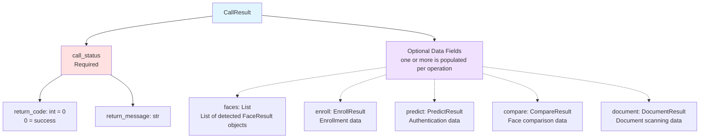
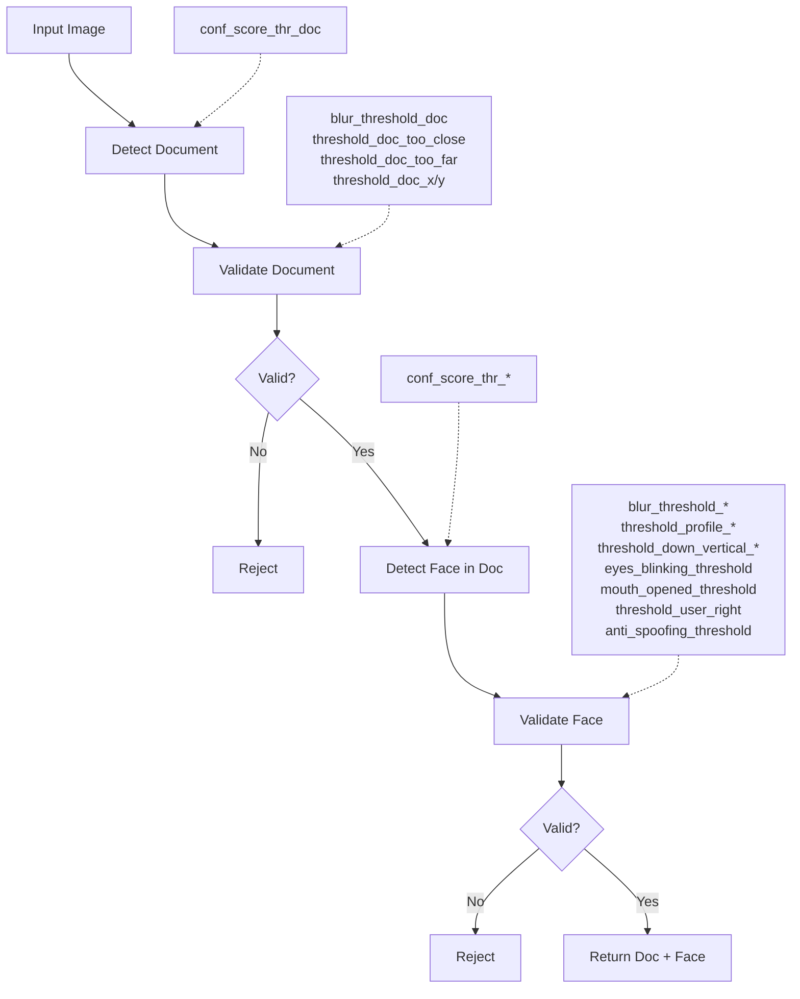
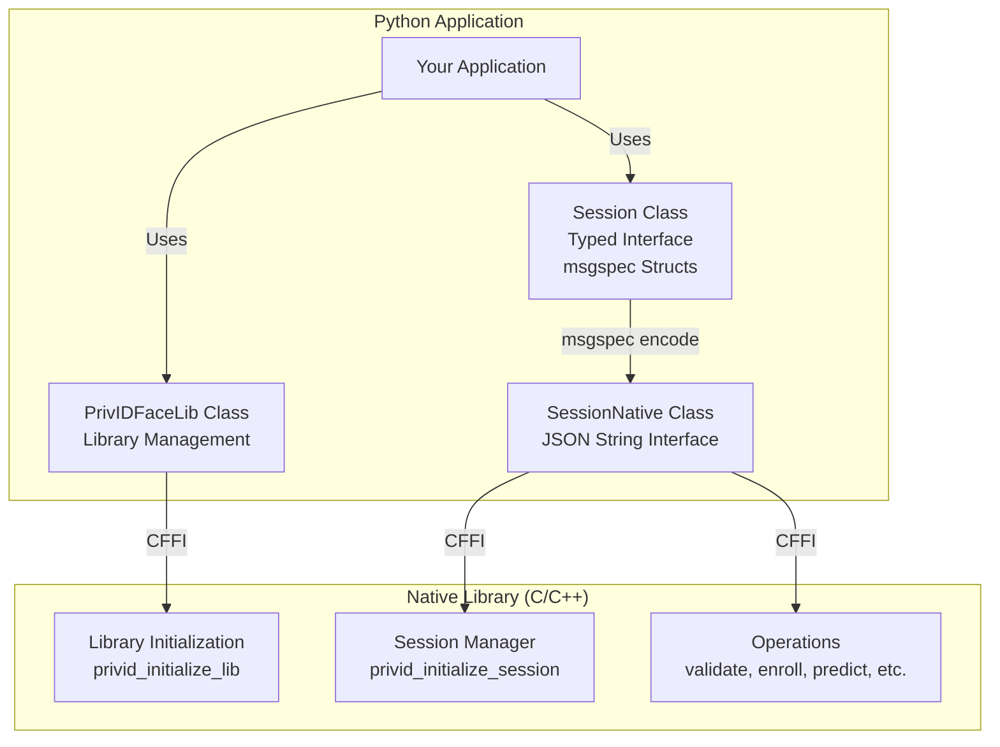

# CryptoNets Python SDK

Python SDK for CryptoNets™ face recognition, biometric authentication, and ID document verification.

## Table of Contents

- [1. Features](#1-features)
- [2. Requirements](#2-requirements)
- [3. Installation](#3-installation)
- [4. Quick Start](#4-quick-start)
- [5. Main Concepts](#5-main-concepts)
- [6. API Architecture & Technical Reference](#6-api-architecture--technical-reference)
- [7. Usage Examples](#7-usage-examples)
- [8. Running Samples](#8-running-samples)
- [9. Operations Configuration](#9-operations-configuration)
- [10. Default Operations Configuration Overrides](#10-default-operations-configuration-overrides)
- [11. License](#11-license)
- [12. Support](#12-support)

## 1. Features

- **Face Recognition**: 1:1 and 1:N face comparison
- **Biometric Authentication**: Enroll and authenticate users with face data
- **Liveness Detection**: Anti-spoofing to detect fake faces
- **Age Estimation**: Estimate age from face images
- **Document Scanning**: Extract face and data from ID documents
- **ISO Compliance**: Generate ISO-compliant face images

## 2. Requirements

- Python >= 3.10
- API Key from [Private Identity](https://private.id)

## 3. Installation

```bash
pip install cryptonets_python_sdk
```

## 4. Quick Start

To start using the features of the SDK, you need to:

1- Initialize the library via

```python
PrivIDFaceLib.initialize()
```

2- Create a session with `session creation settings` that include an API key and the necessary backend configuration.

```python
# Create session settings with collections
settings = SessionSettings(
    collections={
        "default": Collection(
            named_urls={
                "base_url": "YOUR_BASE_URL",
                "predict": "YOUR_BASE_URL/FACE3_4/predict",
                "enroll": "YOUR_BASE_URL/FACE3_4/enroll",
                "deleteUser": "YOUR_BASE_URL/FACE3_4/deleteUser"
            }
        )
    },
    session_token="YOUR_API_KEY"
)
session = Session(settings)
```

3- Perform operations using the created session.

```python
# Provide the necessary Input Image + Operation configuration
image = ImageInputArg("/path/to/image", "rgb")

config = OperationConfig(
    angle_rotation_left_threshold=6.0,
    angle_rotation_right_threshold=5.0,
    anti_spoofing_threshold=0.9,
    eyes_blinking_threshold=0.3
)

# Call the operation method using the session  returns the following tuple
# - `op_id` is a rolling serial number that identifies the operation call - used mainly for debugging or logging 
# - `result` contains the operation success status and the operation result data.
op_id, result = session.enroll_onefa(image, config)

# Check operation status
if result.call_status.return_code == ReturnStatus.API_NO_ERROR:
    print("Operation succeeded")
    # Read the operation result data
    enroll_data = result.enroll
    if enroll_data:
      print("\n Enrollment Data:")
      print(f"\n - Enroll Performed: {enroll_data.enroll_performed}")
      print(f"\n - User puid: {enroll_data.api_response.puid}")
      print(f"\n - Backend API response status (0 mean success): {enroll_data.api_response.status}")
      print(f"\n - Backend API response message: {enroll_data.api_response.message}")   
```

4- Eventually Shutdown the library when your application is done using it to release memory.

```python
PrivIDFaceLib.shutdown()
```

## 5. Main Concepts

### 5.1 Session Creation Settings & Collections

The session creation settings include the API key and the necessary backend configuration to perform the following operations:
 - `API key` authentication end point (performed in the session creation time)  
 - `user` enrollment (registration)
 - `user` prediction (identification/authentification)
 - `user` deletion

Some operations do not require backend calls nor collections, such as face validation, anti-spoofing, age estimation, and document scanning but still require a session to be performed. Thus, they performed offline.

- `user` information data is stored in the backend in homogenous containers called `Collections` and so `enrollment`, `prediction` and `deletion` operations require a `collection` to be specified. 
- With an `API key` a `session` can handle multiple `collections` at once.
- Upon `user` enrollment (registration), the SDK will return a `puid` (private user identifier) that uniquely identifies the user in the collection used for enrollment.
- Each collection has its own endpoints and would provide a different `puid` (user identifier) for the same user `face`.
- A collection is tied to an `embedding model` used to encode the user face image before sending it to the backend. 
- A session creation setting *MUST* contain a collection named `default`.  
- A session can handle multiple collections at once with the same API key.
- The backend is highly customized to integrate your system.
- The `Session creation settings` include also settings like a backend `timeout` duration.

### 5.2 Operation Result

When you call a session level method the SDK returns a tuple containing the operation id and the operation result.
- `op_id` is a rolling serial number that identifies the operation call – used mainly for debugging or logging
- `result` contains the operation success status and the operation result data.

#### 5.2.1 CallResult Structure

The `CallResult` object contains a mandatory `call_status` header and optional operation-specific data fields:

```python
class CallResult(Struct):
    call_status: CallResultHeader  # Always returned
    # all below members are optional
    faces: Union[List[FaceResult], UnsetType] = UNSET  
    document: Union[DocumentResult, UnsetType] = UNSET
    barcode: Union[BarcodeDetectionResult, UnsetType] = UNSET
    compare: Union[CompareResult, UnsetType] = UNSET
    iso_image: Union[IsoImageResult, UnsetType] = UNSET
    enroll: Union[EnrollData, UnsetType] = UNSET
    predict: Union[PredictData, UnsetType] = UNSET
    user_delete: Union[UserDeleteResponse, UnsetType] = UNSET
    user_feedback_message: Union[str, UnsetType] = UNSET
```    




**Structure Details:**

- **call_status** (Required): Contains operation execution status
  - `return_code`: Integer status code reflected by this enum :
      ```python
      class ReturnStatus(IntEnum):
        API_MAL_FORMED_AP_RESPONSE = -7
        API_NETWORK_ERROR = -6
        API_INVALID_ARGUMENT = -5
        API_INVALID_CONFIGURATION = -4
        API_AUTHORIZATION_ERROR = -3
        API_INVALID_SESSION_HANDLER = -2
        API_GENERIC_ERROR = -1
        API_NO_ERROR = 0 # success
      ```

  - `return_message`: Human-readable status message

- **Optional Data Fields**: Depending on the operation called, one of these fields will be populated:
  - `faces`: List of detected faces  
  - `enroll`: Enrollment operation results (includes PUID)
  - `predict`: Authentication/prediction results (includes matched PUID)
  - `compare`: Face comparison results (similarity score, match status)
  - `document`: Document scanning results (extracted document/face data)

- When an operation is successful it returns a `return_code` of `0 - ReturnStatus.API_NO_ERROR` and one or more data field will be populated.
- In case of failure, no data fields will be returned and the `return_code` will be non-zero.
- The `return_message` field contains a human-readable message that can be either an informative or an error message.

### 5.3 Library Initialization and Resource Management

- *Library must be initialized before creating sessions*:
   - Call `PrivIDFaceLib.initialize()` once at application startup
   - During initialization:
     - The native library that is compatible with your current SDK version and machine configuration is fetched from the `library cache` directory and downloaded and stored there if not found. 
     - All heavy ML models will be downloaded from HTTPS and cached locally (if not already cached). Models are downloaded in the `model directory cache` and they are invariant across different SDK versions, so one a model is downloaded upgrading or downgrading your SDK version will not trigger a new download.

**Note**: First-time initialization may take longer due to downloading the native library and ML models. Subsequent initializations will use cached files and be much faster.

- If your application is done using the SDK you can call `PrivIDFaceLib.shutdown()` to release all memory resources.
- Session objects handle their own cleanup automatically when they are destroyed.

```python
# Initialize library at application start
PrivIDFaceLib.initialize()
# create sessions and call its operation methods
# Note: Session cleanup happens automatically when Session object is destroyed
# Explicitly shutdown library to release ML models and native resources
PrivIDFaceLib.shutdown()
```

#### Usage take away(s):

- **Initialize once**: Call `PrivIDFaceLib.initialize()` only once per application instance
- **Multiple sessions**: You can create multiple sessions after initialization if needed
- **Thread safety**: Each session is independent and can be used in different threads
- **Resource cleanup**: Session objects handle their own cleanup automatically
- **Explicit shutdown**: Call `PrivIDFaceLib.shutdown()` when your application exits to explicitly release ML models and native library memory. This ensures all resources are properly freed

### 5.4 Operation Configuration

The Operation behavior is affected by the `OperationConfig` object passed to each operation method.
The `OperationConfig` is a key-value map that defines all possible configurations tweaks for all operations.
You can pass an `empty` `OperationConfig` to use the byuilit-in default configuration values for each operation.
The configurable keys are not related to a specific operation per se,but to what is being configured in each operation. This is why we are using one single object type for all operation types.

For example, in the document scanning operation, configuration you can provide document detection and validation related parameters like :
 
- `blur_threshold_doc`
- `threshold_doc_too_close`
- `threshold_doc_too_far`
- `threshold_doc_x`
- `threshold_doc_y`

and faces detection and validation related parameters like:
   
- `threshold_down_vertical_enroll`
- `threshold_down_vertical_predict`
- `eyes_blinking_threshold`
- `mouth_opened_threshold`
- `threshold_user_right`

### 5.5 Detect then validate logic 

When we need to detect a face in the operation, and a validation step will follow to decide about the quality of the face detected. Only valid faces are returned in the faces list.
The same logic is applied when we need to detect a document (card or passport), validation rules are applied to decide if the document is valid or not. For example, when trying to detect a face inside a document, the following steps are performed:

```text
-> Detect document 
-> Validate document 
-> Detect face inside a document 
-> Validate face inside a document 
```

if we detect a document but not a face, the `CallResult` instance returned will contain the following fields:
- `call_status` (always returned not Null) with return_code = 0.
- `faces` collection will be empty, meaning no face is detected.
- `document` which will contains the data about tyhe documet (geometry, confidence score, etc.)

if no document is detected (and thus no face) the `CallResult` instance returned will contain the following fields:
- `call_status` (always returned not Null) with return_code = 0.
- `faces` collection will be empty, meaning no face is detected.
- `document` which will be null, as no document was detected.




## 6. API Architecture & Technical Reference 

### 6.1 Typed && non-typed APIs for session and operation management

The Python SDK is a wrapper around the a `C` API provided by the *Private ID* native SDK. 
The `C` API uses JSON strings to input configuration and output results.

We provide two types of API for handling session and operations calls:
- a typed (using msgspec structs), generated from the JSON schema.
- a lower-level interface that works directly with JSON strings for implementers convenience.

All types used by SessionNative (input/output) follow a JSON schema defined in:

`sdk/src/cryptonets_python_sdk/idl/json_schemas.json`

This schema can be used for validation, code generation, or integration with other languages/frameworks.



#### 6.1.1 Using SessionNative Directly

The `SessionNative` class provides a lower-level interface that works directly with JSON strings, bypassing the msgspec type-safe wrapper. This is useful if you:

- Want to use your own data types instead of msgspec structs
- Need to work with raw JSON for custom serialization
- Prefer manual control over JSON parsing

```python
from cryptonets_python_sdk import SessionNative
import json

# SessionNative accepts string or bytes for settings JSON
settings_json = '''{
    "collections": {
        "default": {
            "named_urls": {
                "base_url": "YOUR_BASE_URL",
                "predict": "YOUR_BASE_URL/FACE3_4/predict",
                "enroll": "YOUR_BASE_URL/FACE3_4/enroll",
                "deleteUser": "YOUR_BASE_URL/FACE3_4/deleteUser"
            }
        }
    },
    "session_token": "YOUR_API_KEY"
}'''
session_native = SessionNative(settings_json)

# Operations return JSON strings instead of typed objects
config_json = '{"input_image_format": "rgb"}'
image_bytes = open("face.jpg", "rb").read()

op_id, result_json = session_native.validate(image_bytes, config_json)

# Parse JSON manually with your preferred method
result_dict = json.loads(result_json)
print(result_dict["call_status"]["return_code"])
```

Note: We will use the typed API throughout this document as it is simpler to use and more type-safe. 

### 6.2 Main classes reference

#### 6.2.1 PrivIDFaceLib 

The `PrivIDFaceLib` class provides static methods for managing the native library lifecycle. All methods are thread-safe and should be called at the application level (not per-session).

##### `initialize(load_strategy: Optional[LibraryLoadStrategy] = None, log_level: int = 0)`

Initializes the PrivID Face library. Must be called once before creating any sessions.

**Parameters:**
- `load_strategy` (Optional[LibraryLoadStrategy]): Custom library loading strategy. If `None`, uses `DefaultLibraryLoadStrategy()`. 
    For the current version we have only the default strategy, new strategies for the library loading will be added in future versions.
- `log_level` (int): Logging verbosity level
  - `0` = Error only
  - `1` = Warnings
  - `2` = Info
  - `3` = Debug

**Raises:**
- `LibraryLoadError`: If library loading or initialization fails

**Behavior:**
- Downloads and caches the native library if not already cached
- Downloads and caches ML models if not already present
- Thread-safe: Multiple calls are safe; subsequent calls are no-ops if already initialized
- First initialization may take time due to downloads; subsequent runs use cached files

---

##### `shutdown()`

Shuts down the library and releases all resources including ML models and native library memory.

**Behavior:**
- Call when application exits or is completely done with the SDK
- After shutdown, must call `initialize()` again before using the library
- Thread-safe: Safe to call even if not initialized

---

##### `is_initialized() -> bool`

Checks if the library wrapper is currently initialized.

**Returns:**
- `bool`: `True` if initialized, `False` otherwise

---

##### `get_native_sdk_version() -> str`

Gets the version string of the native library.

**Returns:**
- `str`: Version string (e.g., "26.01.02-193aa89")

**Raises:**
- `PrivIDError`: If library not initialized

---

##### `set_log_level(level: int) -> bool`

Sets the logging level for the library at runtime.

**Parameters:**
- `level` (int): Logging level (0=error, 1=warn, 2=info, 3=debug)

**Returns:**
- `bool`: `True` if successful, `False` otherwise

**Raises:**
- `PrivIDError`: If library not initialized
 
---

##### `get_log_level() -> int`

Gets the current logging level.

**Returns:**
- `int`: Current logging level

**Raises:**
- `PrivIDError`: If library not initialized

---

##### `get_models_cache_directory() -> str`

Gets the path to the directory where models and native libraries are cached.

**Returns:**
- `str`: Absolute path to the models cache directory

**Raises:**
- `PrivIDError`: If library not initialized

---

##### `free_buffer(buffer_ptr)` ⚠️ Advanced

Frees a buffer allocated by the native library.

**Parameters:**
- `buffer_ptr`: CFFI pointer object to free

**Warning:**
- Only use if directly calling native library functions
- Most SDK methods handle buffer cleanup automatically
- Using this on already-freed buffers causes undefined behavior

**Raises:**
- `PrivIDError`: If library not initialized

---

##### `free_char_buffer(buffer_ptr)` ⚠️ Advanced

Frees a character buffer allocated by the native library.

**Parameters:**
- `buffer_ptr`: CFFI character buffer pointer to free

**Warning:**
- Only use if directly calling native library functions
- Most SDK methods handle buffer cleanup automatically
- Using this on already-freed buffers causes undefined behavior

**Raises:**
- `PrivIDError`: If library not initialized

---

#### 6.2.2 Session Class Reference

The `Session` class provides a type-safe interface for performing face recognition operations. It uses msgspec structs for all inputs and outputs, providing full type safety and validation.

##### Constructor `__init__(settings: SessionSettings)`

Creates a new session with the specified settings.

**Parameters:**
- `settings` (SessionSettings): Session configuration including collections, API token, and timeouts

**Raises:**
- `SessionError`: If session initialization fails
- `PrivIDError`: If library not initialized

---

##### Constructor (classmethod) `from_json(settings_json: str) -> Session` 

Creates a session from a JSON string.

**Parameters:**
- `settings_json` (str): JSON string matching SessionSettings schema

**Returns:**
- `Session`: New session instance

**Raises:**
- `msgspec.ValidationError`: If JSON doesn't match schema

---

##### Operation Methods

All operation methods return a tuple that gas the 2 first elements are `operation_id` and `CallResult)` where:
- `operation_id` (int): Positive on success, negative on error
- `CallResult`: Typed result with operation-specific data fields

- Some operation extra elements in tuple like output images. 

---

##### `validate(image: ImageInputArg, config: OperationConfig) -> Tuple[int, CallResult]`

Validates face quality by detecting face, checking quality metrics, estimating pose, and performing anti-spoofing.

**Parameters:**
- `image` (ImageInputArg): Input image (file path or numpy array)
- `config` (OperationConfig): Operation configuration

**Returns:**
- `Tuple[int, CallResult]`: Operation ID and result with `faces` field populated

**Result Fields:**
- `call_status`: Operation status
- `faces`: List of FaceResult objects (if faces detected)

---

##### `enroll_onefa(image: ImageInputArg, config: OperationConfig) -> Tuple[int, CallResult]`

Enrolls a face for 1FA authentication. Returns PUID (Private User ID) on success.

**Parameters:**
- `image` (ImageInputArg): Face image to enroll
- `config` (OperationConfig): Operation configuration (must include `collection_name`)

**Returns:**
- `Tuple[int, CallResult]`: Operation ID and result with `enroll` field populated, eventually with `faces` populate if any face is detcted. 

**Result Fields:**
- `call_status`: Operation status
- `faces`: List of FaceResult objects (if faces detected)
- `enroll`: EnrollData with PUID and backend response  

---

##### `face_predict_onefa(image: ImageInputArg, config: OperationConfig) -> Tuple[int, CallResult]`

Authenticates/identifies a face by matching against enrolled faces in collection.

**Parameters:**
- `image` (ImageInputArg): Face image to authenticate
- `config` (OperationConfig): Operation configuration 

**Returns:**
- `Tuple[int, CallResult]`: Operation ID and result with `predict` field populated and eventually with `faces` populated if any face is detcted.

**Result Fields:**
- `call_status`: Operation status
- `faces`: List of FaceResult objects (if faces detected)
- `predict`: PredictData with matched PUID, confidence score, and match status

---

##### `face_compare_files(image_a: ImageInputArg, image_b: ImageInputArg, config: OperationConfig) -> Tuple[int, CallResult]`

Performs 1:1 face comparison between two images.

**Parameters:**
- `image_a` (ImageInputArg): First face image
- `image_b` (ImageInputArg): Second face image
- `config` (OperationConfig): Operation configuration

**Returns:**
- `Tuple[int, CallResult]`: Operation ID and result with `compare` field populated and eventually with `faces` populated if any face is detected on both images. 

**Result Fields:**
- `call_status`: Operation status
- `faces`: List of FaceResult objects (if faces detected on both images)
- `compare`: CompareResult with similarity score and match status

---

##### `estimate_age(image: ImageInputArg, config: OperationConfig) -> Tuple[int, CallResult]`

Estimates age from a face image.

**Parameters:**
- `image` (ImageInputArg): Face image
- `config` (OperationConfig): Operation configuration

**Returns:**
- `Tuple[int, CallResult]`: Operation ID and result with `faces` if faces are detected, the age will be in the `age_data` field of each face.

**Result Fields:**
- `call_status`: Operation status
- `faces`: List with age_data field containing estimated age and confidence

---

##### `face_iso(image: ImageInputArg, config: OperationConfig) -> Tuple[int, CallResult, bytes]`

Generates ISO-compliant face image from input image.

**Parameters:**
- `image` (ImageInputArg): Face image
- `config` (OperationConfig): Operation configuration

**Returns:**
- `Tuple[int, CallResult, bytes]`: Operation ID, result, and ISO image bytes (if operation succeeded)

**Result Fields:**
- `call_status`: Operation status
- `faces`: List of FaceResult objects (if faces detected)
- `iso_image`: IsoImageResult with metadata
- Third tuple element: Raw bytes of ISO-compliant face image

---

##### `anti_spoofing(image: ImageInputArg, config: OperationConfig) -> Tuple[int, CallResult]`

Performs liveness detection to detect spoofing attacks.

**Parameters:**
- `image` (ImageInputArg): Face image
- `config` (OperationConfig): Operation configuration

**Returns:**
**Result Fields:**
- `call_status`: Operation status
- `faces`: List of FaceResult objects, containing a single face if detected. The face contains the `spoof_status` field with the spoofing status.
 

---

#### `doc_scan_face(image: ImageInputArg, config: OperationConfig) -> Tuple[int, bytes, bytes, CallResult]`

Scans ID document, extracts document region and face from document.

**Parameters:**
- `image` (ImageInputArg): Document image
- `config` (OperationConfig): Operation configuration

**Returns:**
- `Tuple[int, bytes, bytes, CallResult]`: Operation ID, document image bytes, face image bytes, and result

**Result Fields:**
- `call_status`: Operation status
- `document`: DocumentResult with document metadata and geometry
- `faces`: List of faces detected in document
- Second tuple element: Cropped document image bytes
- Third tuple element: Cropped face image bytes

---

#### `user_delete(puid: str, config: OperationConfig) -> Tuple[int, CallResult]`

Deletes an enrolled user by PUID.

**Parameters:**
- `puid` (str): User's private unique identifier
- `config` (OperationConfig): Operation configuration (must include `collection_name`)

**Returns:**
- `Tuple[int, CallResult]`: Operation ID and result with `user_delete` field populated

**Result Fields:**
- `call_status`: Operation status
- `user_delete`: UserDeleteResponse with deletion status

---

### 6.2.3 Session Lifecycle

- **Creation**: Call constructor with SessionSettings after library initialization
- **Usage**: Call operation methods as needed
- **Cleanup**: Automatic when Session object is destroyed (uses `__del__`)
- **Thread Safety**: Each session is independent and can be used in separate threads

---

### 6.3 Error Handling

- Library errors are thrown as exceptions.
- Session errors are thrown as exceptions when creating a session.
- Operation errors are returned in the result object `call_status` field with `op_id` negative value.


```python
from cryptonets_python_sdk import SessionError, LibraryLoadError

try:
    PrivIDFaceLib.initialize() # may throw the initialization exception LibraryLoadError 
    settings = SessionSettings(....)
    session = Session(settings)
    op_id, result = session.validate(image, config)
    # Check operation status
    if op_id < 0:
        print(f"Operation failed: {result.call_status.return_message}")

except LibraryLoadError as e:
    print(f"Failed to load native library: {e}")
except SessionError as e:
    print(f"Session error: {e}")
```

## 7. Usage Examples

For more elaborated usage samples, please refer to the [examples](examples) folder for complete usage examples.
 
### 7.1 Face Validation

```python
from msgspec import UNSET, UnsetType
# Detect and validate face quality
image = ImageInputArg("face.jpg", "rgb")
config = OperationConfig(
    anti_spoofing_threshold=0.9,
    eyes_blinking_threshold=0.3
)
op_id, result = session.validate(image, config)

# Check operation status
if result.call_status.return_code < 0:
    print(f"Operation failed")

# Access results
if faces is not UNSET and len(faces) > 0:   
    face = result.faces[0]
    print(f"Confidence: {face.geometry.face_confidence_score}")
    print(f"Spoof status: {face.spoof_status.name}")
```

### 7.2 Face Enrollment & Authentication

```python
from msgspec import UNSET, UnsetType
# Enroll a user
image = ImageInputArg("user_face.jpg", "rgb")
config = OperationConfig(collection_name="employees")
op_id, result = session.enroll_onefa(image, config)

if result.enroll:
    puid = result.enroll.puid
    print(f"Enrolled with PUID: {puid}")

# Authenticate user
op_id, result = session.face_predict_onefa(image, config)

# Check operation status
if result.call_status.return_code < 0:
    print(f"Operation failed")
    
if result.predict is not UNSET and result.predict.predict_performed:
    matched_puid = result.predict.api_response.puid
    print(f"Authenticated: {matched_puid}")
```

### 7.3 Face Comparison

```python
from msgspec import UNSET, UnsetType
# Compare two face images (1:1)
image_a = ImageInputArg("person1.jpg", "rgb")
image_b = ImageInputArg("person2.jpg", "rgb")
config = OperationConfig()

op_id, result = session.face_compare_files(image_a, image_b, config)

# Check operation status
if result.call_status.return_code < 0:
    print(f"Operation failed")

if result.compare  is not UNSET:
    print(f"Match: {result.compare.is_match}")
    print(f"Similarity: {result.compare.similarity_score:.4f}")
```

### 7.4 Document Scanning

```python
from msgspec import UNSET, UnsetType
# Scan ID document and extract face
doc_image = ImageInputArg("drivers_license.jpg", "rgb")
config = OperationConfig()

op_id, result, doc_bytes, face_bytes = session.doc_scan_face(doc_image, config)

# Check operation status
if result.call_status.return_code < 0:
    print(f"Operation failed")

if result.document is not UNSET:
    doc_data = result.document.detected_document
    print(f"Confidence: {doc_data.confidence_score}")
     
```

### 7.5 Age Estimation

```python
from msgspec import UNSET, UnsetType
# Estimate age from face
image = ImageInputArg("person.jpg", "rgb")
config = OperationConfig()
op_id, result = session.estimate_age(image, config)

# Check operation status
if result.call_status.return_code < 0:
    print(f"Operation failed")

if result.faces  is not UNSET and len(result.faces) > 0:
    age_data = result.faces[0].age_data
    print(f"Estimated age: {age_data.estimated_age}")
    print(f"Confidence: {age_data.age_confidence_score}")
```

### 7.6 Anti-Spoofing

```python
from msgspec import UNSET, UnsetType
# Detect liveness / spoofing
from cryptonets_python_sdk import SpoofStatus

image = ImageInputArg("selfie.jpg", "rgb")
config = OperationConfig(
    anti_spoofing_mode=1,  # 1 = XMS mode (default), 0 = Off, 2 = JPD, 3 = Recognito Android
    anti_spoofing_threshold=0.9
)

op_id, result = session.anti_spoofing(image, config)

# Check operation status
if result.call_status.return_code < 0:
    print(f"Operation failed")

if result.faces is not UNSET and len(result.faces) > 0:
   face = result.faces[0]
   status_code = face.spoof_status.code
  if status_code == SpoofStatus.AS_NO_SPOOF_DETECTED:
      print("Live face detected")
  elif status_code == SpoofStatus.AS_SPOOF_DETECTED:
      print("Spoof detected - not a live face")
```

### 7.7 Face Detection Strategies

The SDK provides multiple strategies for detecting and selecting faces when processing images. Use the `face_detection_strategy` parameter to control this behavior.

```python
from msgspec import UNSET

# Strategy 0: Multiple faces - returns all detected faces
image = ImageInputArg("group_photo.jpg", "rgb")
config = OperationConfig(
    face_detection_strategy=0  # Return all detected faces
)
op_id, result = session.validate(image, config)

if result.faces is not UNSET:
    print(f"Detected {len(result.faces)} faces")
    for i, face in enumerate(result.faces):
        print(f"Face {i+1} confidence: {face.geometry.face_confidence_score}")

# Strategy 1: Best confidence score (default) - single face with highest confidence
config = OperationConfig(
    face_detection_strategy=1  # Best confidence score (default)
)
op_id, result = session.validate(image, config)

if result.faces is not UNSET and len(result.faces) > 0:
    print(f"Best confidence face: {result.faces[0].geometry.face_confidence_score}")

# Strategy 2: Biggest face - single face with largest area
config = OperationConfig(
    face_detection_strategy=2  # Biggest face by area
)
op_id, result = session.validate(image, config)

# Strategy 3: Hybrid - best score of (area × confidence)
config = OperationConfig(
    face_detection_strategy=3  # Hybrid scoring
)
op_id, result = session.validate(image, config)
```

### 7.8 Working with Face and Document Traits

Face and document trait flags provide detailed quality and validation information about detected faces and documents. These flags are returned as bitmasks that can contain multiple active traits simultaneously.

#### 7.8.1 Face Trait Flags

Face traits indicate quality issues, pose problems, or detected attributes of a face. The SDK provides the `FaceTraitsFlags` enum with the following flags:

**Position and Distance:**

- `FT_FACE_NO_TRAIT` - No issues detected (ideal case)
- `FT_FACE_TOO_CLOSE` - Face is too close to camera
- `FT_FACE_TOO_FAR` - Face is too far from camera
- `FT_FACE_RIGHT` - Face is too far to the right in frame
- `FT_FACE_LEFT` - Face is too far to the left in frame
- `FT_FACE_UP` - Face is too high in frame
- `FT_FACE_DOWN` - Face is too low in frame

**Head Pose:**

- `FT_LOOKING_LEFT` - Head rotated/looking left (profile view)
- `FT_LOOKING_RIGHT` - Head rotated/looking right (profile view)
- `FT_LOOKING_HIGH` - Head tilted/looking up
- `FT_LOOKING_DOWN` - Head tilted/looking down

**Image Quality:**

- `FT_IMAGE_BLURR` - Face image is blurry
- `FT_FACE_TOO_DARK` - Face is underexposed/too dark
- `FT_FACE_TOO_BRIGHT` - Face is overexposed/too bright
- `FT_FACE_LOW_VAL_CONF` - Low validation confidence
- `FT_INVALID_FACE_BACKGROUND` - Background doesn't meet requirements

**Face Attributes:**

- `FT_FACE_WITH_GLASS` - Person wearing glasses
- `FT_FACE_WITH_MASK` - Person wearing face mask
- `FT_EYE_BLINK` - Eyes are closed or blinking
- `FT_MOUTH_OPENED` - Mouth is open

#### 7.8.2 Document Trait Flags

Document traits indicate quality or positioning issues with detected ID documents. The SDK provides the `DocumentTraits` enum:

**Quality:**

- `DT_DOC_NO_TRAIT` - No issues detected (ideal case)
- `DT_DOCUMENT_WITH_LOW_CONFIDENCE_SCORE` - Low detection confidence
- `DT_DOCUMENT_IS_BLURRY` - Document image is blurry/out of focus

**Position and Distance:**

- `DT_DOCUMENT_IS_CLOSE` - Document too close to camera
- `DT_DOCUMENT_IS_FAR` - Document too far from camera
- `DT_DOCUMENT_IS_LEFT` - Document positioned too far left
- `DT_DOCUMENT_IS_RIGHT` - Document positioned too far right
- `DT_DOCUMENT_IS_UP` - Document positioned too high
- `DT_DOCUMENT_IS_DOWN` - Document positioned too low

**Occlusion:**

- `DT_FINGERS_DETECTED` - Fingers covering part of document

#### 7.8.3 Working with Trait Flags

The `FlagUtil` helper class provides methods to work with these bitmask flags:

```python
from msgspec import UNSET, UnsetType
from cryptonets_python_sdk import FaceTraitsFlags, DocumentTraits, FlagUtil

# Example 1: Extract face trait flags
op_id, result = session.validate(image, config)

if result.faces is not UNSET and len(result.faces) > 0:
    face = result.faces[0]

    # Get active traits as flag objects
    traits = FlagUtil.get_active_flags(FaceTraitsFlags, face.face_traits_flags)
    for trait in traits:
        print(f"Trait: {trait.name} (value: {trait.value})")

    # Get trait names as strings
    trait_names = FlagUtil.get_flag_names(FaceTraitsFlags, face.face_traits_flags)
    print(f"Active traits: {', '.join(trait_names)}")

    # Check for specific trait
    if face.face_traits_flags & FaceTraitsFlags.FT_FACE_WITH_MASK:
        print("Warning: Face mask detected")

# Example 2: Extract document trait flags
op_id, result, doc_bytes, face_bytes = session.doc_scan_face(doc_image, config)

if result.document is not UNSET:
    doc_traits = result.document.detected_document.document_traits

    # Get active document traits
    traits = FlagUtil.get_active_flags(DocumentTraits, doc_traits)
    for trait in traits:
        print(f"Document issue: {trait.name}")

    # Check for specific issues
    if doc_traits & DocumentTraits.DT_DOCUMENT_IS_BLURRY:
        print("Document is blurry - please capture a sharper image")

    if doc_traits & DocumentTraits.DT_FINGERS_DETECTED:
        print("Fingers detected - please don't cover the document")
```

#### 7.8.4 Using Traits for Validation

Trait flags are useful for providing user feedback during capture:

```python
def validate_face_quality(face_result):
    """Provide user guidance based on face traits."""
    traits = face_result.face_traits_flags

    if traits == FaceTraitsFlags.FT_FACE_NO_TRAIT:
        return "Face looks good!"

    messages = []
    if traits & FaceTraitsFlags.FT_FACE_TOO_CLOSE:
        messages.append("Move camera further away")
    if traits & FaceTraitsFlags.FT_FACE_TOO_FAR:
        messages.append("Move camera closer")
    if traits & FaceTraitsFlags.FT_IMAGE_BLURR:
        messages.append("Hold camera steady")
    if traits & FaceTraitsFlags.FT_LOOKING_LEFT or traits & FaceTraitsFlags.FT_LOOKING_RIGHT:
        messages.append("Face camera directly")
    if traits & FaceTraitsFlags.FT_EYE_BLINK:
        messages.append("Keep eyes open")

    return " | ".join(messages) if messages else "Face detected"
```

## 8. Running Samples

The SDK includes an interactive sample application:

```bash
cd sdk/examples
python samples.py
```

This displays a menu to run individual samples or all samples together.

**Note**: The samples demonstrate proper library lifecycle management, including:

- Library initialization at startup: `PrivIDFaceLib.initialize()`
- Session creation and usage
- **Library shutdown on exit**: The samples properly clean up resources when the application exits, releasing ML models and native library resources

## 9. Operations Configuration 

All operations accept an `OperationConfig` object that controls behavior. This section covers the most commonly used configuration options.

### 9.1 Common Configuration

```python
config = OperationConfig(
    # Image format
    input_image_format="rgb",  # or "bgr", "rgba"

    # Collection for enrollment/prediction
    collection_name="employees",

    # Face detection strategy
    face_detection_strategy=1,  # 0=Multiple faces, 1=Best confidence (default), 2=Biggest face, 3=Hybrid

    # Anti-spoofing mode
    anti_spoofing_mode=1,  # 0=Off, 1=XMS (default), 2=JPD, 3=Recognito Android
    anti_spoofing_threshold=0.9,

    # Face landmarks model
    base_landmarks_model_id=0,  # 0=Head pose model (default), 22=Yolov5n05
)
```

### 9.2 Configuration Reference

### 9.3 General Configuration

#### 9.3.1 Basic Settings

| Key | Type | Default | Description |
|-----|------|---------|-------------|
| `input_image_format` | string | `"rgb"` | Input image color format. Valid values: `"rgb"`, `"bgr"`, `"rgba"` |
| `context_string` | string | `"enroll"` | Operation context. Valid values: `"enroll"`, `"predict"`. Affects which threshold values are used for face validation |
| `identifier` | string | `""` | User or operation identifier for tracking purposes |

#### 9.3.2 HTTP and Networking

| Key | Type | Default | Description |
|-----|------|---------|-------------|
| `fetch_timeout_ms` | int | `5000` | HTTP request timeout in milliseconds for backend API calls |
| `https_verify_peer_cert` | bool | `false` | Enable SSL/TLS certificate verification for HTTPS requests |

#### 9.3.3 Backend Integration

| Key | Type | Default | Description |
|-----|------|---------|-------------|
| `collection_name` | string | `""` | Name of the collection to use for backend operations |
| `send_original_images` | bool | `false` | Send original unprocessed images to backend (increases bandwidth) |

---

### 9.4 Face Detection and Quality

#### 9.4.1 Face Detection Confidence

| Key | Type | Default | Description |
|-----|------|---------|-------------|
| `conf_score_thr_enroll` | float | `0.5` | Face detection confidence threshold for enrollment operations |
| `conf_score_thr_predict` | float | `0.12` | Face detection confidence threshold for prediction operations |
| `landmark_confidence_score_threshold` | float | `0.5` | Confidence threshold for face landmarks detection |


#### 9.4.2 Face Quality Thresholds

| Key | Type | Default | Description |
|-----|------|---------|-------------|
| `blur_threshold_enroll_pred` | float | `10.0` | Blur threshold for face quality (lower values = blurrier face rejected) |
| `face_too_bright` | float | `0.85` | Upper brightness threshold (0.0-1.0). Values above indicate face is too bright |
| `face_too_dark` | float | `0.25` | Lower brightness threshold (0.0-1.0). Values below indicate face is too dark |


#### 9.4.3 Face Matching Thresholds

| Key | Type | Default | Description |
|-----|------|---------|-------------|
| `face_thresholds_min` | float | `0.3` | Minimum face matching threshold |
| `face_thresholds_med` | float | `0.5` | Medium face matching threshold |
| `face_thresholds_max` | float | `0.65` | Maximum face matching threshold |
| `neighbors` | int | `1` | Number of neighbors to consider in face matching algorithms |
| `fudge_factor` | float | `1.0` | Adjustment factor for matching thresholds |

#### 9.4.4 Base Face Landmarks Model

| Key | Type | Default | Description |
|-----|------|---------|-------------|
| `base_landmarks_model_id` | int | `0` | Identifier of the face landmark model to use. `0` = Head pose model (default), `22` = Yolov5n05 model |

#### 9.4.5 Face Selection Strategy

| Key | Type | Default | Description |
|-----|------|---------|-------------|
| `face_detection_strategy` | int | `1` | Face selection strategy: `0` = Multiple faces (all detected faces returned), `1` = Best confidence score (single face with highest confidence), `2` = Biggest face (single face with largest area), `3` = Hybrid (best score of area × confidence) |
| `face_validations_off` | bool | `false` | Disable face traits extraction and validation checks |

---

### 9.5 Face Pose and Position

#### 9.5.1 Profile Angle Thresholds

| Key | Type | Default | Description |
|-----|------|---------|-------------|
| `threshold_profile_enroll` | float | `0.7` | Profile angle threshold for enrollment (higher = more strict frontal face required) |
| `threshold_profile_predict` | float | `0.85` | Profile angle threshold for prediction (higher = more strict frontal face required) |

#### 9.5.2 Vertical Angle Thresholds (Looking Up/Down)

| Key | Type | Default | Description |
|-----|------|---------|-------------|
| `threshold_high_vertical_enroll` | float | `-0.1` | Looking up threshold for enrollment (negative = looking up) |
| `threshold_high_vertical_predict` | float | `-0.1` | Looking up threshold for prediction |
| `threshold_down_vertical_enroll` | float | `0.15` | Looking down threshold for enrollment (positive = looking down) |
| `threshold_down_vertical_predict` | float | `0.1` | Looking down threshold for prediction |

#### 9.5.3 Face Rotation Thresholds

| Key | Type | Default | Description |
|-----|------|---------|-------------|
| `angle_rotation_left_threshold` | float | `20.0` | Maximum allowed left rotation angle in degrees |
| `angle_rotation_right_threshold` | float | `20.0` | Maximum allowed right rotation angle in degrees |

#### 9.5.4 Face Position in Frame

| Key | Type | Default | Description |
|-----|------|---------|-------------|
| `threshold_user_right` | float | `0.01` | Right boundary threshold (0.0-1.0, normalized to frame width) |
| `threshold_user_left` | float | `0.99` | Left boundary threshold (0.0-1.0, normalized to frame width) |
| `threshold_user_up` | float | `0.01` | Upper boundary threshold (0.0-1.0, normalized to frame height) |
| `threshold_user_down` | float | `0.99` | Lower boundary threshold (0.0-1.0, normalized to frame height) |
| `threshold_user_too_far` | float | `0.2` | Face too far from camera threshold (face area ratio) |
| `threshold_user_too_close` | float | `0.8` | Face too close to camera threshold (face area ratio) |
| `validate_face_position_oval` | bool | `false` | Enable oval-shaped face position validation (stricter positioning) |

---


### 9.6 Face Attributes Detection

#### 9.6.1 Eyes and Mouth

| Key | Type | Default | Description |
|-----|------|---------|-------------|
| `eyes_blinking_threshold` | float | `0.6` | Threshold for detecting closed eyes/blinking (0.0-1.0) |
| `mouth_opened_threshold` | float | `0.8` | Threshold for detecting open mouth (0.0-1.0) |
| `get_smile_intensity` | bool | `false` | Calculate and return smile intensity score |

#### 9.6.2 Face Traits Flags

| Key | Type | Default | Description |
|-----|------|---------|-------------|
| `allowed_face_traits_flags` | uint32 | `0` | Bitmask of face traits to override the list of traits that would fail an enroll or a predict operation |

---

### 9.7 Anti-Spoofing (Liveness Detection)

| Key | Type | Default | Description |
|-----|------|---------|-------------|
| `anti_spoofing_mode` | int | `1` | Anti-spoofing mode: `0` = Off (no anti-spoofing), `1` = XMS (dual XMS models, works with head pose landmarks), `2` = JPD (JPD model, works with yolov5n_05_float16 landmarks), `3` = Recognito Android (for Android, works with yolov5n_05_float16 landmarks) |
| `anti_spoofing_threshold` | float | `0.9` | Liveness confidence threshold (0.0-1.0). Higher = stricter liveness requirement |
| `anti_spoofing_detect_document` | bool | `false` | Enable detection of ID document spoofing (photo of document) |

---

### 9.8 Document Scanning

#### 9.8.1 Document Detection

| Key | Type | Default | Description |
|-----|------|---------|-------------|
| `conf_score_thr_doc` | float | `0.3` | Document detection confidence threshold |
| `blur_threshold_doc` | float | `1700.0` | Document blur threshold (higher = sharper document required) |
| `threshold_doc_too_close` | float | `0.99` | Document too close threshold (document area ratio) |
| `threshold_doc_too_far` | float | `0.3` | Document too far threshold (document area ratio) |
| `threshold_doc_x` | float | `0.02` | Horizontal position tolerance for document alignment |
| `threshold_doc_y` | float | `0.02` | Vertical position tolerance for document alignment |

#### 9.8.2 Document Processing Options

| Key | Type | Default | Description |
|-----|------|---------|-------------|
| `detect_document_only` | bool | `false` | Only detect document boundaries without extracting face |
| `document_auto_rotation` | bool | `false` | Try to rotate document to detect the best face and the correct orientation |
| `doc_validations_off` | bool | `false` | Disable all document traits extraction and validation checks  |
| `face_validations_off` | bool | `false` | Disable face traits extraction and validation checks |

#### 9.8.3 Barcode Detection (for future versions when we wrap `back document` scanning with barcodes)

| Key | Type | Default | Description |
|-----|------|---------|-------------|
| `document_scan_barcode_only` | bool | `false` | Only scan for barcodes without document/face detection |
| `detect_barcode_without_parsing` | bool | `false` | Detect barcode presence without parsing contents |
| `conf_score_thr_barcode` | float | `0.25` | Barcode detection confidence threshold |
| `barcode_margin` | float | `0.1` | Margin around detected barcode region (0.0-1.0) |

#### 9.8.4 MRZ (Machine Readable Zone)

| Key | Type | Default | Description |
|-----|------|---------|-------------|
| `detect_and_recognize_mrz_code` | bool | `false` | Detect and parse MRZ from passport/ID documents |
| `mrz_segmented_input` | bool | `false` | Input image contains pre-segmented MRZ region |
| `calculate_age_from_ocr_text` | bool | `false` | Extract and calculate age from OCR text on document |

#### 9.8.5 Document Quality

| Key | Type | Default | Description |
|-----|------|---------|-------------|
| `check_fingers_over_document` | bool | `false` | Detect if fingers are covering parts of the document |
| `fingers_over_document_threshold` | float | `0.5` | Threshold for finger occlusion detection (0.0-1.0) |

---

### 9.9 Face Landmark Model Configuration

| Key | Type | Default | Description |
|-----|------|---------|-------------|
| `base_face_landmarks_model_id` | int | `-1` | Model ID to use for face landmarks (-1 = default, 0 = head pose model, 22 = yolov5n_05) |

---

### 9.10 ISO Image Background Color 

| Key | Type | Default | Description |
|-----|------|---------|-------------|
| `background_color_rgb` | uint32 | `0xF0F0F0` | RGB background color for generated images (e.g., ISO face images) |

--- 

## 10. Default Operations Configuration Overrides

### 10.1 Enroll

- Default config override for enroll operation:
  - `threshold_user_too_far` : 0.2f

- Invalid face traits flags:
  - FT_FACE_WITH_GLASS 
  - FT_FACE_WITH_MASK 
  - FT_LOOKING_RIGHT 
  - FT_LOOKING_LEFT 
  - FT_LOOKING_HIGH 
  - FT_LOOKING_DOWN 
  - FT_FACE_RIGHT 
  - FT_FACE_LEFT 
  - FT_FACE_UP 
  - FT_FACE_DOWN 
  - FT_MOUTH_OPENED 
  - FT_IMAGE_BLURR 
  - FT_FACE_TOO_FAR 
  - FT_FACE_TOO_CLOSE 
  - FT_FACE_ROTATED_RIGHT 
  - FT_FACE_ROTATED_LEFT

### 10.2 Predict

- Default config override for predict operation:
  - `threshold_user_too_far`:  0.1f
  - `threshold_user_right`:  0.01f
  - `threshold_user_left`:  0.99f
  
- Invalid face traits flags:
  - FT_LOOKING_RIGHT 
  - FT_LOOKING_LEFT 
  - FT_LOOKING_HIGH 
  - FT_LOOKING_DOWN 
  - FT_FACE_RIGHT 
  - FT_FACE_LEFT 
  - FT_FACE_UP 
  - FT_FACE_DOWN 
  - FT_IMAGE_BLURR 
  - FT_FACE_TOO_FAR 
  - FT_FACE_TOO_CLOSE 
  - FT_FACE_ROTATED_RIGHT 
  - FT_FACE_ROTATED_LEFT

### 10.3 Document Scanning (doc_scan_face)

- Default config override for document scanning operation:
  - `context_string`: 'predict'
  - `blur_threshold_doc`: 100.0f
  - `conf_score_thr_doc`: 0.8f
  - `blur_threshold_enroll_pred`: 50.0f
  - `threshold_user_too_far`: 0.01f
  - `threshold_user_right`: 0.01f
  - `threshold_user_left`: 0.99f
  - `threshold_user_down`: 0.99f
  - `threshold_user_up`: 0.01f

---

## 11. License

Copyright (c) 2020-present, Private Identity. All rights reserved.

**Licensing Restriction**: This SDK requires a license from Private Identity. Not licensed for use without consent.

## 12. Support

- V1 Documentation: [SDK Docs](https://privid-sdk.s3.us-east-2.amazonaws.com/cryptonets-python-sdk/last_stable/)
- Sign up: [Private Identity](https://private.id)
- Issues: <support@private.id>
