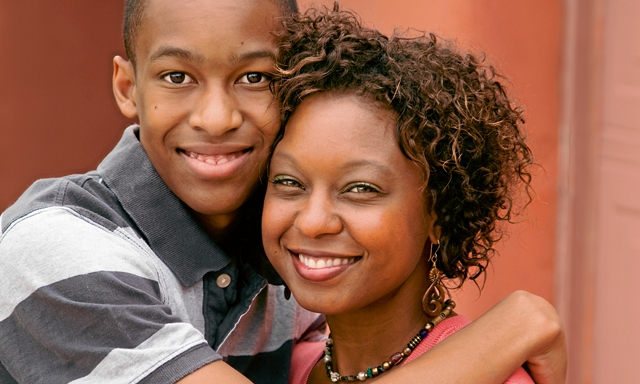

Usage
=====

Python Version
--------------

We recommend using the latest version of Python. Cryptonets-SDK supports
Python 3.6 and newer.

Install Cryptonets SDK
----------------------

.. code-block:: sh

    pip3 install cryptonets_python_sdk

Setup
-----

Server URL and API Key are prerequisites for accessing factor server

To set it up in environment variables, use the following commands

.. code-block:: sh

    export PI_SERVER_URL = "SERVER_URL"
    export PI_API_KEY = "YOUR_API_KEY"

Once you have setup environment variables, you can use the face factor object directly

.. code-block:: py

    # Import the cryptonets sdk class
    from cryptonets_python_sdk.factor import FaceFactor

    # Create a Face factor class instance
    face_factor = FaceFactor()

Import and Usage
----------------

You can setup server url and api key using the face factor instance too.

.. code-block:: py

    # Import the cryptonets sdk class
    from cryptonets_python_sdk.factor import FaceFactor

    # Replace with the provided server URL
    server_url = "https://sample.url.domain"

    # Replace with your API key
    api_key = "your-api-key"

    # Create a Face factor class instance
    face_factor = FaceFactor(server_url = server_url, api_key = api_key)

is_valid: Find, Validate and return facial biometric
----------------------------------------------------

The is_valid method accepts an image, apiKey and specified restrictions as input,
checks the image to determine if a valid facial biometric that conforms to the specified restriction(s) are present in the image,
and returns the valid, perfectly cropped and aligned facial biometric or useful error code(s).

Use isValid during live capture to find the valid biometric or return user instruction (remove eyeglasses, remove mask, chin too far right, look at camera, etc.).

| Method runs on-device and replies in 50ms without a server call
| Head tilt (left to right): -22.5 to 22.5 degrees
| Uncontrolled pose, but not full profile
| Recommended minimum face: 224 x 224 pixels, smaller facial images may reduce accuracy but will not result in false positives
| Face cropping: It is best to provide the original image to isValid without preprocessing.  If using a cropped image as input, use as much padding around the head as possible, perhaps using an ISO 19794-5/INCITS 385-2004 (S2019) Face Portrait compliant image.

.. image:: images/isvalid_example.png
   :width: 600
.. code-block:: py

    # Check if the image is valid

    is_valid_handle = face_factor.is_valid(image_path = "path_to_the_image") ## Replace with the path to the image

Output:

.. code-block:: py

    is_valid_handle.error # Error code of the operation
    is_valid_handle.message # Message of the operation
    is_valid_handle.face_objects # List of Face objects with results

Example:

.. code-block:: py

    #Create a Face factor class instance
    face_factor = FaceFactor(server_url=SERVER_URL, api_key=api_key)

    is_valid_handle = face_factor.is_valid(image_path=img_path)
    for index, face in enumerate(is_valid_handle.face_objects):
            print("Face#:{}\nReturn Code:{}\nMessage:{}\nBBox TL:{}\nBBox BR:{}\n".format(index + 1,face.return_code,face.message,face.bounding_box.top_left_coordinate.__str__(), face.bounding_box.bottom_right_coordinate.__str__()))

See :ref:`return codes <return_codes>` for all result and status codes

Output:

.. code-block:: py

    Face#:1         // The closest (largest) face
    Return Code:0
    Message:ValidBiometric
    BBox TL:Point(257.5,151.0)
    BBox BR:Point(430.5,313.0)

    Face#:2         // The next closest face
    Return Code:0
    Message:ValidBiometric
    BBox TL:Point(130.0,45.5)
    BBox BR:Point(290.0,212.5)

See the :ref:`is_valid advanced instructions <isvalid_advanced>` section for more configuration options.

estimate_age: Estimate user's age
---------------------------------

The estimate_age method accepts a frontal facial image, apiKey and specified restrictions as input,
checks the image to determine if a valid facial biometric that conforms to the specified restriction(s) are present in the image,
and returns the age estimate [0-100] plus bounding box, or useful error code(s).

Use estimate_age during live capture to continually estimate a user’s age.

| Method runs on-device and replies in 50ms without a server call
| Head tilt (left to right): -22.5 to 22.5 degrees
| Uncontrolled pose, but not full profile
| Recommended minimum face: 224 x 224 pixels, smaller facial images may reduce accuracy but will not result in false positives
| Face cropping: It is best to provide the original image to isValid without preprocessing.  If using a cropped image as input, use as much padding around the head as possible, perhaps using an ISO 19794-5/INCITS 385-2004 (S2019) Face Portrait compliant image or similar.

.. image:: images/age_example.png
   :width: 600
   
.. code-block:: py

    # Estimate user's age

    age_handle = face_factor.estimate_age(image_path = "path_to_the_image") ## Replace with the path to the image

Output:

See :ref:`return codes <return_codes>` for all result and status codes

.. code-block:: py

    age_handle.error # Error code of the operation
    age_handle.message # Message of the operation
    age_handle.face_objects # List of Face objects with results
    
Example:

.. code-block:: py

    #Create a Face factor class instance
    face_factor = FaceFactor(server_url=SERVER_URL, api_key=api_key)

    age_handle = face_factor.estimate_age(image_path=img_path)
    for index, face in enumerate(age_handle.face_objects):
            print("Face#:{}\nReturn Code:{}\nMessage:{}\nAge:{}\nBBox TL:{}\nBBox BR:{}\n".format(index + 1,face.return_code,face.message,face.age,face.bounding_box.top_left_coordinate.__str__(),face.bounding_box.bottom_right_coordinate.__str__()))
        
Output:

See :ref:`return codes <return_codes>` for all result and status codes

.. code-block:: py

    Face#:1                     //The closest (largest) face
    Return Code:0
    Message:ValidBiometric
    Age:29.490659713745117
    BBox TL:Point(257.5,151.0)
    BBox BR:Point(430.5,313.0)

    Face#:2                     //The next closest face
    Return Code:0
    Message:ValidBiometric
    Age:20.64322280883789
    BBox TL:Point(130.0,45.5)
    BBox BR:Point(290.0,212.5)

See the :ref:`estimate_age advanced instructions <age_advanced>` section for more configuration options.

compare: 1:1 verification of two valid face images
--------------------------------------------------

The compare method accepts two frontal facial images, apiKey and specified restriction(s) as input,
checks the images to determine if both contain a valid frontal facial biometric that conforms to the specified restriction(s),
and returns if the subjects are the same person (0) or different subjects (-1) with useful error code(s).

| Method runs on-device and replies in 50ms without a server call
| Head tilt (left to right): -22.5 to 22.5 degrees
| Uncontrolled pose, but not full profile
| Recommended minimum face: 224 x 224 pixels, smaller facial images may reduce accuracy but will not result in false positives
| Face cropping: It is best to provide the original image to isValid without preprocessing.  If using a cropped image as input, use as much padding around the head as possible, perhaps using an ISO 19794-5/INCITS 385-2004 (S2019) Face Portrait compliant image or similar.

.. code-block:: py

    # Check if the image is valid

    compare_handle = face_factor.compare(image_path_1 = "path_to_the_image1", image_path_2 = "path_to_the_image2") ## Replace with the path to the image

Output:

See :ref:`return codes <return_codes>` for all result and status codes

.. code-block:: py

    compare_handle.status # Status of the operation
    compare_handle.result # Result of the operation
    compare_handle.message # Message of the operation
    compare_handle.distance_min # Min distance of compare
    compare_handle.distance_mean # Mean distance of compare
    compare_handle.distance_max # Max distance of compare
    compare_handle.first_validation_result #Image 1 validation result
    compare_handle.second_validation_result #Image 2 validation result

Example:

.. image:: images/tom_hanks.png
   :width: 190

.. image:: images/tom_hanks_2.jpg
   :width: 200

.. code-block:: py

    #Create a Face factor class instance
    face_factor = FaceFactor(server_url=SERVER_URL, api_key=api_key)	
    compare_handle = face_factor.compare(image_path=img_path, image_path_2=img_path2)
    print("Status:{}\nResult:{}\nMessage:{}\nMin:{}\nMean:{}\nMax:{}\n1VR:{}\n2VR:{}\n".format(compare_handle.status,compare_handle.result, compare_handle.message, compare_handle.distance_min,compare_handle.distance_mean,compare_handle.distance_max, compare_handle.first_validation_result,compare_handle.second_validation_result))
            
Output:

See :ref:`return codes <return_codes>` for all result and status codes

.. code-block:: py

  Status:1
  Result:1
  Message: OK
  Min:0.9422853589057922
  Mean:0.9422853589057922
  Max:0.9422853589057922
  1VR:0
  2VR:0

See the :ref:`compare advanced instructions <compare_advanced>` section for more configuration options.

enroll: initialize subject’s face in identification system
----------------------------------------------------------

The enroll method accepts a frontal facial image, apiKey and specified restrictions as input,
checks the image to determine if a valid facial biometric that conforms to the specified restriction(s) are present in the image,
[if valid] augments and transforms the plaintext facial biometric(s) into 50 into a fifty fully homomorphic encryption (FHE) ciphertexts,
deletes the original plaintext biometric, transmits the ciphertext to the backend, and

returns (0) plus the resulting new UUID and GUID to the user;
if the user is already enrolled, it returns (0) and the existing UUID and GUID to the user;
if the facial biometric image is invalid, it returns (-1) and useful error code(s).

| Method replies in 1400ms, including server call
| Head tilt (left to right): -22.5 to 22.5 degrees
| Recommend controlled pose with no eyeglasses or facemask, user facing forward toward camera for maximum accuracy;
| Recommended minimum face: 224 x 224 pixels, smaller facial images may reduce accuracy but will not result in false positives
| Face cropping: It is best to provide the original image to isValid without preprocessing.  If using a cropped image as input, use as much padding around the head as possible, perhaps using an ISO 19794-5/INCITS 385-2004 (S2019) Face Portrait compliant image or similar.

.. code-block:: py

    # Enroll operation

    enroll_handle = face_factor.enroll(image_path = "path_to_the_image") ## Replace with the path to the image

Output:

.. code-block:: py

    enroll_handle.status # Status of the operation
    enroll_handle.message # Message of the operation
    enroll_handle.enroll_level
    enroll_handle.uuid
    enroll_handle.guid
    enroll_handle.token

Example:

.. image:: images/tom_hanks.png
   :width: 400
.. code-block:: py

    #Create a Face factor class instance
    face_factor = FaceFactor(server_url=SERVER_URL, api_key=api_key)	
    enroll_handle = face_factor.enroll(image_path=img_path)
    print("Status:{}\nMessage:{}\nEnroll Level:{}\nUUID:{}\nGUID:{}\nToken:{}\n".format(enroll_handle.status,enroll_handle.message,enroll_handle.enroll_level,enroll_handle.uuid,enroll_handle.guid,enroll_handle.token))
            
Output:

.. code-block:: py

  Status:0          # enroll successful
  Message: Ok.
  Enroll Level:1
  UUID:2o4747qo77op7140747o
  GUID:rq0rqpo647s317n30145
  Token:None

See the :ref:`enroll advanced instructions <enroll_advanced>` section for more configuration options.

predict: 1:N match of a probe image to the enrolled gallery
-----------------------------------------------------------

The predict method accepts one frontal facial probe image containing one or more face(s), apiKey and specified restrictions as input
checks the image to determine if a valid facial biometric that conforms to the specified restriction(s) are present in the image,
[if valid] transforms the plaintext facial biometric(s) into fully homomorphic encryption (FHE) ciphertexts,
deletes the original plaintext image, transmits the ciphertext to the backend, and

returns (0) plus the resulting UUID and GUID to the user;
if the image does not contain any valid enrolled face(s), it returns (-1) and useful error code(s).

| Method replies in 200ms, including the server call
| Head tilt (left to right): -22.5 to 22.5 degrees
| Uncontrolled pose, but not full profile
| Recommended minimum face: 224 x 224 pixels, smaller facial images may reduce accuracy but will not result in false positives
| Face cropping: It is best to provide the original image to isValid without preprocessing.  If using a cropped image as input, use as much padding around the head as possible, perhaps using an ISO 19794-5/INCITS 385-2004 (S2019) Face Portrait compliant image or similar.

.. code-block:: py

    # Predict the image

    predict_handle = face_factor.predict(image_path = "path_to_the_image") ## Replace with the path to the image

Output:

.. code-block:: py

    predict_handle.status # Status of the operation
    predict_handle.message # Message of the operation
    predict_handle.enroll_level
    predict_handle.uuid
    predict_handle.guid
    predict_handle.token

Example:

.. image:: images/tom_hanks.png
   :width: 400
.. code-block:: py

    #Create a Face factor class instance
    face_factor = FaceFactor(server_url=SERVER_URL, api_key=api_key)	
    predict_handle = face_factor.predict(image_path=img_path)
    print("Status:{}\nMessage:{}\nEnroll Level:{}\nUUID:{}\nGUID:{}\nToken:{}\n".format(predict_handle.status,predict_handle.message,predict_handle.enroll_level,predict_handle.uuid,predict_handle.guid,predict_handle.token))      

Output:

.. code-block:: py

  Status:0      # Predict successful
  Message: Ok.
  Enroll Level:1
  UUID:2o4747qo77op7140747o
  GUID:rq0rqpo647s317n30145
  Token:None

See the :ref:`predict advanced instructions <predict_advanced>` section for more configuration options.

remove user’s uuid from the server, and remove full enrollment if no other uuid’s remain
----------------------------------------------------------------------------------------

Accepts a UUID and apiKey as input, if more than one UUIDs exist for the user then deletes the specified UUID from the identification system and
returns (0); if only one UUID exists, then delete all enrollment data;
if the specified UUID does not exist returns (-1).

.. code-block:: py

    # Delete the enrollment

    delete_handle = face_factor.delete(uuid="uuid") ## Replace with the UUID

Output:

.. code-block:: py

    delete_handle.status # Status of the operation
    delete_handle.message # Message of the operation

Example:

.. code-block:: py

    #Create a Face factor class instance
    face_factor = FaceFactor(server_url=SERVER_URL, api_key=api_key)	
    delete_handle = face_factor.delete(uuid)
    print("Status:{}\nMessage:{}".format(delete_handle.status, delete_handle.message))

Output:

.. code-block:: py

    Status:0
    Message: Ok.

get_iso_face: Extract ISO Spec Face Image
-----------------------------------------

The get_iso_face method accepts a frontal facial image, apiKey and specified restrictions as input,
checks the image to determine if a valid facial biometric that conforms to the specified restriction(s) are present in the image,
and returns the iso face image, or useful error code(s).

Use get_iso_face during live capture to continually acquire iso image.

| Method runs on-device and replies in 50ms without a server call
| Head tilt (left to right): -22.5 to 22.5 degrees
| Uncontrolled pose, but not full profile
| Recommended minimum face: 224 x 224 pixels, smaller facial images may reduce accuracy but will not result in false positives
| Face cropping: It is best to provide the original image to isValid without preprocessing.  If using a cropped image as input, use as much padding around the head as possible

.. image:: images/iso_face_example.jpg
   :width: 407

.. code-block:: py

    # Get ISO Face image

    iso_face_handle = face_factor.get_iso_face(image_path = "path_to_the_image") ## Replace with the path to the image

Output:

.. code-block:: py

    iso_face_handle.status # Status of the operation
    iso_face_handle.message # Message of the operation
    iso_face_handle.image # PIL Image object
    iso_face_handle.confidence # Confidence Score for the image
    iso_face_handle._iso_image_width # Width of the image
    iso_face_handle._iso_image_height # Height of the image
    iso_face_handle.iso_image_channels # Number of image channels

Example:

.. image:: images/johny.jpg
   :width: 407
.. code-block:: py

    #Create a Face factor class instance
    face_factor = FaceFactor(server_url=SERVER_URL, api_key=api_key)

    get_iso_face_handle = face_factor.get_iso_face(image_path=img_path)
    print(
        "Status:{}\nMessage:{}\nISO_image_width:{}\nISO_image_height: {}\nISO_image_channels:{}\nConfidence:{} ".format(
            get_iso_face_handle.status, get_iso_face_handle.message, get_iso_face_handle.iso_image_width,
            get_iso_face_handle.iso_image_height, get_iso_face_handle.iso_image_channels,
            get_iso_face_handle.confidence))

Output:

.. code-block:: py

    Status:0
    Message: OK
    ISO_image_width:360
    ISO_image_height: 480
    ISO_image_channels:4
    Confidence:0.999437153339386

See the :ref:`get_iso_face advanced instructions <iso_face_advanced>` section for more configuration options.

.. toctree::
   :maxdepth: 2

   AdvancedUsage
