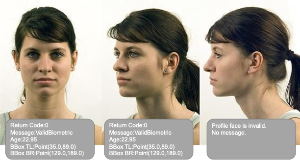
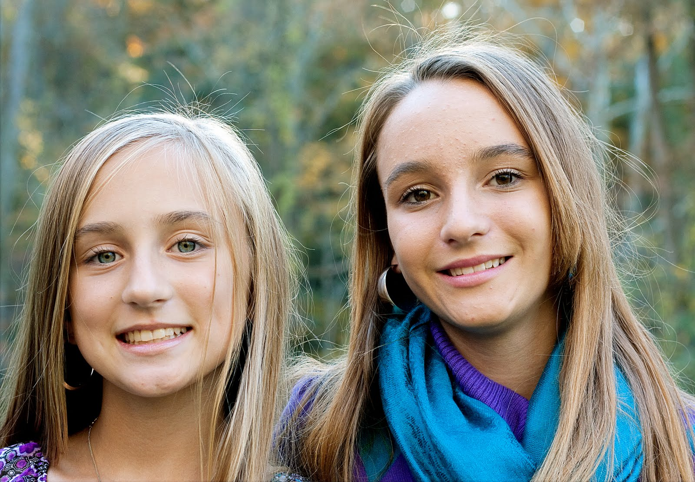

CryptoNets SDK Usage Guide
==========================

API_KEY and SERVER_URL initialization parameters
------------------------------------------------

To access the factor server, you need to configure the server URL and API key.
These values should be stored in environment variables for secure and streamlined access.

Set the environment variables with the following commands:

.. code-block:: sh

    export PI_SERVER_URL = "SERVER_URL"
    export PI_API_KEY = "YOUR_API_KEY"

Also, they can be passed directly to the FaceFactor constructor as we will show in the next section.

Create and the Face Factor Object
---------------------------------

You need to create an instance of the FaceFactor class in order to start using the SDK's FaceFactor object.

You can rely on environment variables to set the server URL and API key:

.. code-block:: py

    # Import the FaceFactor class from the CryptoNets SDK
    from cryptonets_python_sdk.factor import FaceFactor

    # Create an instance of the FaceFactor class using the environment variables
    face_factor = FaceFactor()

Or set the server URL and API key directly:

.. code-block:: py

    # Import the FaceFactor class from the CryptoNets SDK
    from cryptonets_python_sdk.factor import FaceFactor

    # Define the server URL and API key
    server_url = "https://sample.url.domain"  # Replace with your server URL
    api_key = "your-api-key"  # Replace with your API key

    # Initialize the FaceFactor instance with the server URL and API key
    face_factor = FaceFactor(server_url=server_url, api_key=api_key)

With this setup, you're ready to use the CryptoNets™ SDK to generate and verify private IDs.

1) is_valid(): Validating Facial Biometrics
-------------------------------------------

The ``is_valid`` method checks an image for the presence of a valid facial biometric that meets specified restrictions.
This function processes the image, validates the facial biometric, and returns a facial validation result or relevant error codes.

This method is ideal for live capture scenarios, as it can guide users to make necessary adjustments (e.g., "remove eyeglasses," "remove mask," "look at camera") to ensure a valid facial image is captured.

Key Features of ``is_valid``:

* Runs on-device, responding within 50ms without requiring a server call
* Supports head tilt from -22.5 to 22.5 degrees (left to right)
* Allows uncontrolled poses (though not full profile)
* Minimum recommended face size is 224 x 224 pixels for optimal accuracy
* For best results, use an unprocessed image with as much padding around the face as possible, compliant with ISO 19794-5/INCITS 385-2004 (S2019) standards.

Sample Usage:

.. code-block:: py

    # Import the FaceFactor class from the CryptoNets SDK
    from cryptonets_python_sdk.factor import FaceFactor

    # Initialize FaceFactor with the server URL and API key
    face_factor = FaceFactor(server_url=SERVER_URL, api_key=API_KEY)

    # Validate the image
    is_valid_result = face_factor.is_valid(image_path="path_to_the_image")  # Replace with the actual image path

    # Accessing results
    error_code = is_valid_result.error        # Error code, if any
    message = is_valid_result.message         # Operation message
    face_objects = is_valid_result.face_objects  # List of detected Face objects

Example Output:

.. code-block:: py

    # Loop through detected faces
    for index, face in enumerate(is_valid_handle.face_objects):
        print(f"Face #:{index + 1}")
        print(f"Return Code: {face.return_code}")
        print(f"Message: {face.message}")
        print(f"BBox Top Left: {face.bounding_box.top_left_coordinate}")
        print(f"BBox Bottom Right: {face.bounding_box.bottom_right_coordinate}\n")

Output:

.. code-block:: py

    Face#:1
    -------
    Return Code:0
    Message:ValidBiometric
    Age:None
    BBox TL:Point(187.0,153.0)
    BBox BR:Point(382.0,334.0)

For a complete list of return and status codes, see :ref:`return codes <return_codes>`.
Additional configurations can be found in the :ref:`is_valid advanced instructions <isvalid_advanced>` section.

2) estimate_age(): Determining User Age
---------------------------------------

The ``estimate_age`` method analyzes a frontal facial image to determine if a valid biometric match is present
based on specified restrictions, and it returns an estimated age (range: 0-100) along with the bounding box or relevant error codes.

This method is particularly useful for live capture applications where continuous age estimation is required.

Key Features of ``estimate_age``:

* Runs on-device with ~50ms response time, eliminating the need for server calls
* Supports head tilt between -22.5 to 22.5 degrees (left to right)
* Allows uncontrolled poses (excluding full profiles)
* Recommended minimum face size is 224 x 224 pixels for optimal accuracy
* For best results, provide the original image without cropping. If a cropped image is used, include as much padding around the head as possible, following standards like ISO 19794-5/INCITS 385-2004 (S2019).

Sample Usage:

.. code-block:: py

    # Import the FaceFactor class from the CryptoNets SDK
    from cryptonets_python_sdk.factor import FaceFactor

    # Initialize FaceFactor with the server URL and API key
    face_factor = FaceFactor(server_url=SERVER_URL, api_key=API_KEY)

    # Estimate age
    age_handle = face_factor.estimate_age(image_path="path_to_the_image")  # Replace with the actual image path

    # Accessing results
    error_code = age_handle.error         # Error code, if any
    message = age_handle.message          # Operation message
    face_objects = age_handle.face_objects  # List of detected Face objects

    
Example Output:

.. code-block:: py

    # Loop through detected faces and print the results
    for index, face in enumerate(age_handle.face_objects):
        print(f"Face: {index + 1}")
        print(f"Return Code: {face.return_code}")
        print(f"Message: {face.message}")
        print(f"Age: {face.age}")
        print(f"BBox Top Left: {face.bounding_box.top_left_coordinate}")
        print(f"BBox Bottom Right: {face.bounding_box.bottom_right_coordinate}\n")

Output:

.. code-block:: py

    Face#:1
    -------
    Return Code:0
    Message:ValidBiometric
    Age:21.47
    BBox TL:Point(859.0,189.0)
    BBox BR:Point(1296.0,759.0)

    Face#:2
    -------
    Return Code:0
    Message:ValidBiometric
    Age:18.19
    BBox TL:Point(134.0,356.0)
    BBox BR:Point(580.0,908.0)

For a complete list of return and status codes, see :ref:`return codes <return_codes>`.
Additional configurations can be found in the :ref:`estimate_age advanced instructions <age_advanced>` section.

3) compare(): 1:1 Verification of Face Images
---------------------------------------------

The ``compare`` method performs a 1:1 verification of two frontal facial images, analyzing them to determine if both images contain valid frontal facial biometrics that meet specified restrictions.
It then returns whether the subjects in the images are the same person (Result: 1) or different subjects (Result: -1), along with additional information and error codes if applicable.

Key Features of ``compare``:

* Runs on-device with a ~50ms response time, without requiring a server call
* Supports head tilt between -22.5 to 22.5 degrees (left to right)
* Allows uncontrolled poses (excluding full profiles)
* Recommended minimum face size is 224 x 224 pixels for optimal accuracy
* For best results, provide the original image without cropping. If a cropped image is used, include as much padding around the head as possible, following standards like ISO 19794-5/INCITS 385-2004 (S2019).

Sample Usage:

.. code-block:: py

    # Import the FaceFactor class from the CryptoNets SDK
    from cryptonets_python_sdk.factor import FaceFactor

    # Initialize FaceFactor with the server URL and API key
    face_factor = FaceFactor(server_url=SERVER_URL, api_key=API_KEY)

    # Compare two images
    compare_handle = face_factor.compare(image_path_1="path_to_image1", image_path_2="path_to_image2")  # Replace with actual paths

    # Accessing results
    status = compare_handle.status                  # Status of the operation
    result = compare_handle.result                  # Result: 1 (same person), -1 (different person)
    message = compare_handle.message                # Operation message
    distance_min = compare_handle.distance_min      # Minimum comparison distance
    distance_mean = compare_handle.distance_mean    # Mean comparison distance
    distance_max = compare_handle.distance_max      # Maximum comparison distance
    first_validation = compare_handle.first_validation_result   # Validation result for the first image
    second_validation = compare_handle.second_validation_result  # Validation result for the second image

Example Output:

.. image:: images/tom_hanks_2.jpg
   :width: 200

.. code-block:: py

    # Display comparison results
    print(f"Status: {compare_handle.status}")
    print(f"Result: {compare_handle.result}")
    print(f"Message: {compare_handle.message}")
    print(f"Min Distance: {compare_handle.distance_min}")
    print(f"Mean Distance: {compare_handle.distance_mean}")
    print(f"Max Distance: {compare_handle.distance_max}")
    print(f"Image 1 Validation Result: {compare_handle.first_validation_result}")
    print(f"Image 2 Validation Result: {compare_handle.second_validation_result}")

            
Output:

.. code-block:: py

    Status:0
    Result:1
    Message:
    Min:0.4671628773212433
    Mean:0.4671628773212433
    Max:0.4671628773212433
    1VR:0
    2VR:0

For a complete list of return and status codes, see :ref:`return codes <return_codes>`.
Additional configurations can be found in the :ref:`compare advanced instructions <compare_advanced>` section.

4) compare_doc_with_face(): 1:1 Verification of a Face Image and Document Image
-------------------------------------------------------------------------------

The ``compare_doc_with_face`` method enables 1:1 verification by comparing a frontal facial image with a facial image on a driver’s license or similar document. It takes a facial image and a document image as input, along with the API key and specified restrictions, and assesses whether the facial biometrics match.
The method returns 1 if the images are from the same individual and -1 if they are not, along with any relevant error codes.

Key Features of ``compare_doc_with_face``:

* Runs on-device with a ~200ms response time, without requiring a server call
* Supports head tilt between -22.5 to 22.5 degrees (left to right)
* Allows uncontrolled poses (excluding full profiles)
* Recommended minimum face size is 224 x 224 pixels for optimal accuracy
* For best results, use the original image without cropping. If using a cropped image, include as much padding around the head as possible, in line with ISO 19794-5/INCITS 385-2004 (S2019) standards.

Sample Usage:

.. code-block:: py

    # Import the FaceFactor class from the CryptoNets SDK
    from cryptonets_python_sdk.factor import FaceFactor

    # Initialize FaceFactor with the server URL and API key
    face_factor = FaceFactor(server_url=SERVER_URL, api_key=API_KEY)

    # Perform 1:1 verification between a face image and a document image
    compare_doc_with_face_handle = face_factor.compare_doc_with_face(
        face_path="path_to_face_image",   # Path to the portrait image
        doc_path="path_to_DL_image"       # Path to the document (e.g., driver's license) image
    )

    # Accessing results
    status = compare_doc_with_face_handle.status                  # Status of the operation
    result = compare_doc_with_face_handle.result                  # Result: 1 (same person), -1 (different subjects)
    message = compare_doc_with_face_handle.message                # Operation message
    distance_min = compare_doc_with_face_handle.distance_min      # Minimum comparison distance
    distance_mean = compare_doc_with_face_handle.distance_mean    # Mean comparison distance
    distance_max = compare_doc_with_face_handle.distance_max      # Maximum comparison distance
    first_validation = compare_doc_with_face_handle.first_validation_result  # Validation result for the face image
    second_validation = compare_doc_with_face_handle.second_validation_result # Validation result for the document image

Example Output:

.. code-block:: py

    # Display comparison results
    print(f"Status: {compare_doc_with_face_handle.status}")
    print(f"Result: {compare_doc_with_face_handle.result}")
    print(f"Message: {compare_doc_with_face_handle.message}")
    print(f"Min Distance: {compare_doc_with_face_handle.distance_min}")
    print(f"Mean Distance: {compare_doc_with_face_handle.distance_mean}")
    print(f"Max Distance: {compare_doc_with_face_handle.distance_max}")
    print(f"Face Image Validation Result: {compare_doc_with_face_handle.first_validation_result}")
    print(f"Document Image Validation Result: {compare_doc_with_face_handle.second_validation_result}")

Sample Output:

.. code-block:: py

    Status:0
    Result:1
    Message:"Same Face"
    Min:0.46
    Face Image Validation Result:0
    Document Image Validation Result:0

For a complete list of return and status codes, see :ref:`return codes <return_codes>`.
Additional configurations can be found in the :ref:`compare advanced instructions <compare_advanced>` section.

5) antispoof_check(): Spoof Detection in Facial Recognition
-----------------------------------------------------------

The ``antispoof_check`` method is designed to enhance the security of facial recognition systems by distinguishing authentic live captures from potential spoof attempts.
By analyzing specific characteristics within the image, this method helps prevent fraudulent access.

* Accepts a single frontal face image.
* Analyzes the image for signs of spoofing, such as texture irregularities or digital alterations.
* Returns an ``AntispoofCheckResult`` object, which includes the status, message, and a boolean indicating if spoofing was detected.
* **On-device processing**: The check runs locally, with a typical response time of 100ms, requiring no server communication.
* **Image Requirements**:igh-resolution images (224 x 224 pixels minimum) are recommended. Lower resolutions are supported, though detection accuracy may vary.
* **Head Pose**:Effective for frontal views, within a range of -15 to +15 degrees for both yaw and pitch.
* **Best Practices**:se unprocessed images for optimal results. If cropping is needed, include sufficient background around the face.

The ``AntispoofCheckResult`` encapsulates the output of the antispoof check, with these attributes:

* **status**: Integer that indicates the status of the operation.
* **message**: A descriptive message about the operation’s outcome.
* **is_antispoof**: Boolean that indicates whether a spoofing attempt was detected (``True`` if spoofing detected, ``False`` otherwise).

Sample Usage:

.. code-block:: python

   # Import the FaceFactor class from the CryptoNets SDK
    from cryptonets_python_sdk.factor import FaceFactor

    # Initialize FaceFactor with server URL and API key
    face_factor = FaceFactor(server_url=SERVER_ADDRESS, api_key=API_KEY)

    # Perform antispoof check
    antispoof_result = face_factor.antispoof_check(image_path="path_to_face_image")  # Replace with the actual image path

    # Accessing results
    print("Status: {}\nMessage: {}\nSpoof Detected: {}".format(
        antispoof_result.status, antispoof_result.message, antispoof_result.is_antispoof))

Sample Output:

.. code-block:: py

    Status: 0
    Message: 'No spoofing detected.'
    Spoof Detected: False

Refer to :ref:`return_codes <return_codes>` for a comprehensive list of possible result and status codes.

6) enroll(): Initialize Subject’s Face in the Identification System
-------------------------------------------------------------------

The ``enroll`` method is used to register a subject’s facial biometric in the identification system.
It accepts a frontal facial image, along with an API key and specified restrictions.
This method verifies if the image contains a valid facial biometric that meets the specified criteria.
If valid, it transforms the biometric data into homomorphic token ciphertexts, deletes the original plaintext biometric, and securely transmits the ciphertext to the backend.

Process Flow:

* If enrollment is successful and the user is new, the method returns 0 along with a new PUID and GUID.
* If the user is already enrolled, it returns 0 and the existing PUID and GUID.
* If the image is invalid, it returns -1 along with relevant error codes.

Key features of ``enroll``:

* The operation completes within 200ms, including server processing time.
* Supports head tilt from -22.5 to 22.5 degrees (left to right).
* Recommended for controlled poses with no eyeglasses or facemasks, facing forward for highest accuracy.
* Minimum recommended face size is 224 x 224 pixels.
* For best results, provide the original image without cropping. If cropped, ensure there is adequate padding around the head, ideally following ISO 19794-5/INCITS 385-2004 (S2019) standards.

Sample Usage:

.. code-block:: py

    # Import the FaceFactor class from the CryptoNets SDK
    from cryptonets_python_sdk.factor import FaceFactor

    # Initialize FaceFactor with server URL and API key
    face_factor = FaceFactor(server_url=SERVER_URL, api_key=API_KEY)

    # Enroll a subject's face
    enroll_handle = face_factor.enroll(image_path="path_to_the_image")  # Replace with the actual image path

    # Accessing results
    print("Status: {}\nMessage: {}\nEnroll Level: {}\nPUID: {}\nGUID: {}\nToken: {}".format(
        enroll_handle.status,
        enroll_handle.message,
        enroll_handle.enroll_level,
        enroll_handle.puid,
        enroll_handle.guid,
        enroll_handle.token
    ))

Output Description:

Each enroll operation returns an EnrollHandle object with the following attributes:

- **status**: Indicates the status of the operation (0 for success, -1 for failure).
- **message**: Provides a message detailing the result of the operation.
- **enroll_level**: Represents the enrollment level of the user.
- **puid**: The unique PUID assigned to the enrolled user.
- **guid**: The unique GUID for the enrolled user.
- **token**: A token, if applicable, for additional security measures.

Example Output:

Output:

.. code-block:: py

  Status:0          # enroll successful
  Message: Ok.
  Enroll Level:1
  PUID:2o4747qo77op7140747o
  GUID:rq0rqpo647s317n30145
  Token:None

For additional configuration options and advanced settings, see the :ref:`enroll advanced instructions <enroll_advanced>` section.

7) predict(): 1:N Matching of a Probe Image to the Enrolled Gallery
-------------------------------------------------------------------

The ``predict`` method performs a 1:n match, comparing a single probe image containing one or more faces against a gallery of enrolled faces.
This method verifies if the probe image meets specified restrictions, transforms valid facial biometrics into homomorphic token ciphertexts, deletes the original plaintext data, and securely transmits the ciphertext to the backend.

Process Flow:

* If a match is found with an enrolled face, the method returns 0 along with the matched PUID and GUID.
* If no valid enrolled face is found, it returns -1 with appropriate error codes.

Key Features of ``predict``:

* The operation completes within ~200ms, including server processing.
* Supports head tilt from -22.5 to 22.5 degrees (left to right).
* Allows uncontrolled poses, though not full profiles.
* Minimum recommended face size is 224 x 224 pixels.
* For best results, provide the original image without cropping. If using a cropped image, include ample padding around the head, ideally following ISO 19794-5/INCITS 385-2004 (S2019) standards.

Sample Usage:

.. code-block:: py

    # Import the FaceFactor class from the CryptoNets SDK
    from cryptonets_python_sdk.factor import FaceFactor

    # Initialize FaceFactor with server URL and API key
    face_factor = FaceFactor(server_url=SERVER_URL, api_key=API_KEY)

    # Perform a 1:N match with the probe image
    predict_handle = face_factor.predict(image_path="path_to_the_image")  # Replace with the actual image path

    # Accessing results
    print("Status: {}\nMessage: {}\nEnroll Level: {}\nPUID: {}\nGUID: {}\nToken: {}".format(
        predict_handle.status,
        predict_handle.message,
        predict_handle.enroll_level,
        predict_handle.puid,
        predict_handle.guid,
        predict_handle.token
    ))

Output Description:

The predict method returns a PredictHandle object containing the following attributes:

- **status**: Indicates the status of the operation (0 for success, -1 for failure).
- **message**: Provides a message detailing the result of the operation.
- **enroll_level**: Specifies the enrollment level of the user.
- **puid**: The unique PUID associated with the matched user.
- **guid**: The unique GUID associated with the matched user.
- **token**: A token, if applicable, for additional security.

Example:

.. image:: images/tom_hanks_2.jpg
   :width: 400

Output:

.. code-block:: py

  Status:0      # Predict successful
  Message: Ok.
  Enroll Level:1
  PUID:2o4747qo77op7140747o
  GUID:rq0rqpo647s317n30145
  Token:None

For advanced settings and configuration options, see the :ref:`predict advanced instructions <predict_advanced>` section.

8) delete(): Remove a User’s PUID from the Server
-------------------------------------------------

The ``delete`` method is used to remove a user’s PUID (Personal Unique Identifier) from the identification system.
This method accepts a PUID and an API key as input and performs the following actions:

| If multiple PUIDs are associated with the user, it deletes only the specified PUID and returns 0.
| If only one PUID is associated with the user, it deletes all enrollment data for that user.
| If the specified PUID does not exist, it returns -1 with an appropriate error code.

Sample Usage:

.. code-block:: py

    # Import the FaceFactor class from the CryptoNets SDK
    from cryptonets_python_sdk.factor import FaceFactor

    # Initialize FaceFactor with server URL and API key
    face_factor = FaceFactor(server_url=SERVER_URL, api_key=API_KEY)

    # Delete the specified PUID
    delete_handle = face_factor.delete(puid="puid")  # Replace with the actual PUID

    # Accessing results
    print("Status: {}\nMessage: {}".format(delete_handle.status, delete_handle.message))

Output Description:

The delete method returns a DeleteHandle object with the following attributes:

- **status**: Indicates the status of the operation (0 for successful deletion, -1 for failure).
- **message**: Provides a message detailing the result of the operation.

Output:

.. code-block:: py

    Status:0
    Message: Ok.

9) get_iso_face(): Extract ISO Spec Face Image
----------------------------------------------

The ``get_iso_face`` method captures an ISO-compliant facial image, adhering to specified restrictions.
This method accepts a frontal facial image along with an API key, verifies if the image meets the required restrictions, and returns the ISO face image or relevant error codes if validation fails.

This function is ideal for live capture scenarios to continually acquire ISO-compliant images.

Key Features of ``get_iso_face``:

* Runs on-device with a response time of ~50ms, without requiring a server call.
* Supports head tilt from -22.5 to 22.5 degrees (left to right).
* Allows uncontrolled poses but excludes full profiles.
* Minimum recommended face size is 224 x 224 pixels.
* For best results, provide the original image without cropping. If cropped, ensure there is sufficient padding around the head.

Sample Usage:

.. code-block:: py

    # Import the FaceFactor class from the CryptoNets SDK
    from cryptonets_python_sdk.factor import FaceFactor

    # Initialize FaceFactor with server URL and API key
    face_factor = FaceFactor(server_url=SERVER_URL, api_key=API_KEY)

    # Extract an ISO-compliant face image
    iso_face_handle = face_factor.get_iso_face(image_path="path_to_the_image")  # Replace with the actual image path

    # Accessing results
    print("Status: {}\nMessage: {}\nISO Image Width: {}\nISO Image Height: {}\nISO Image Channels: {}\nConfidence: {}".format(
        iso_face_handle.status,
        iso_face_handle.message,
        iso_face_handle.iso_image_width,
        iso_face_handle.iso_image_height,
        iso_face_handle.iso_image_channels,
        iso_face_handle.confidence
    ))

Output Description:

The get_iso_face method returns an IsoFaceHandle object with the following attributes:

- **status**: Indicates the status of the operation (0 for success, error code for failure).
- **message**: Provides a message detailing the result of the operation.
- **image**: The ISO-compliant image as a PIL Image object.
- **confidence**: Confidence score for the image's validity.
- **iso_image_width**: Width of the ISO image.
- **iso_image_height**: Height of the ISO image.
- **iso_image_channels**: Number of color channels in the image.

Example Output:

Output:

.. code-block:: py

    Status:0
    Message: OK
    ISO_image_width:360
    ISO_image_height: 480
    ISO_image_channels:4
    Confidence:0.999437153339386

For advanced configuration options, refer to the :ref:`get_iso_face advanced instructions <iso_face_advanced>` section.

.. toctree::
   :maxdepth: 2

   AdvancedUsage
